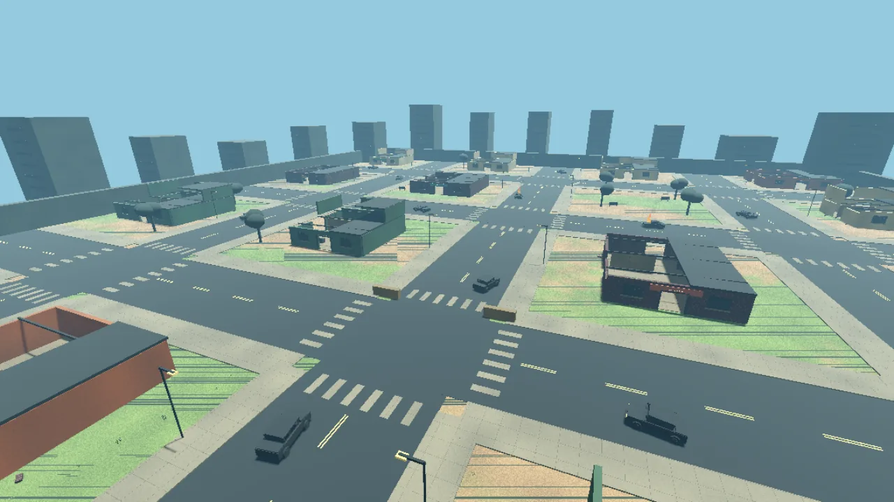
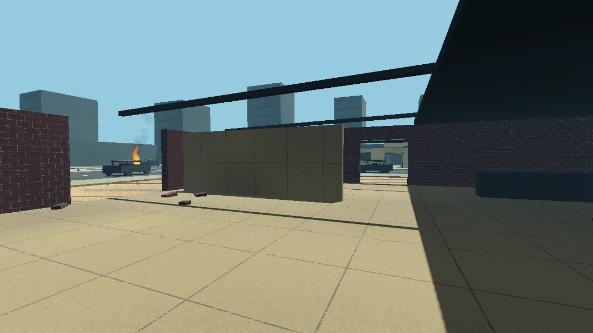
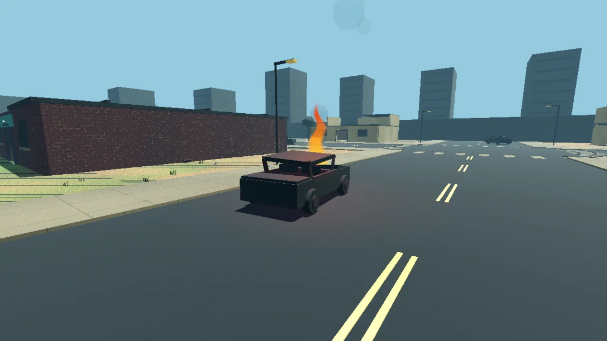
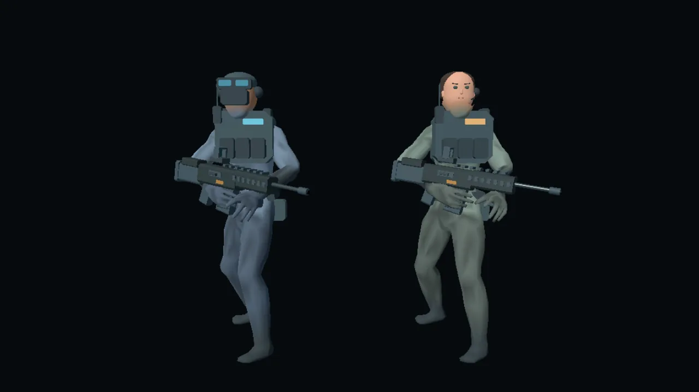

# Ciudad, simulación y operadora — avance recuperable

Fecha de inicio: 2026-09-16. Proyecto: Gh0stDeveloper/NEXORA-DEADFALL.
Base comprobada: main `959a6cb53767718902b1eeb33feebf2848911644`.
El propietario confirmó que la actualización anterior ya funciona.
Rama de trabajo: `agent/city-simulation-upgrade`.

## Encargo

Ampliar el mapa a una ciudad con colores naturales, pasto, tierra, asfalto,
vehículos destruidos, fuego y edificios destruidos con interiores accesibles.
Corregir zombis inmóviles, mantener en el servidor solamente simulación,
colisiones, navegación, IA y red, y medir la causa del ping alto. Conservar
DANTE y sustituir la presentación del otro operador por una mujer.

## Fases y criterios de aceptación

- [x] 0. Recuperar la base y guardar este plan en una rama remota.
- [x] 1. Persecución y servidor: hordas persiguen a jugadores aunque aparezcan
  fuera de su visión; navegan alrededor de obstáculos; el dedicado no instancia
  mallas, cámaras, luces, etiquetas 3D ni audio. Conservar colisiones autoritativas.
  Separar RTT de partida del tiempo HTTP del lobby, mostrar mediciones reales
  y obtener métricas de carga con cuatro clientes.
- [x] 2. Ciudad: aumentar superficie transitable, calles y aceras, patios de
  tierra/pasto, varias casas accesibles, ruinas, vehículos y fuego del cliente.
  Compartir exactamente la geometría de colisión y los objetivos entre cliente
  y servidor. Verificar caminos hasta interiores y puntos de misión.
- [x] 3. Personajes: mantener DANTE y reemplazar el otro aspecto por una operadora
  femenina reconocible; conservar identificadores de cuenta compatibles.
  Revisar lobby, dúo, escuadra, tercera persona y agarre de armas.
- [x] 4. Integración: compilar scripts, ejecutar navegación real y partidas ENet,
  inspeccionar imágenes renderizadas y registrar resultados, límites y comandos
  de actualización. Publicar cada fase como checkpoint sin forzar historial.

## Hallazgos iniciales (todavía no son correcciones validadas)

- El mapa actual tiene un piso de 72 × 72 m y edificios sólidos sin puertas.
- HordeDirector crea zombis sin asignar objetivo. La IA sólo adquiere jugadores
  visibles a unos 20 m; varios puntos de aparición quedan fuera de ese alcance.
- La navegación consulta si terminó antes de solicitar su primer punto de ruta.
  Hay que probar movimiento real, no solamente transiciones de estado.
- El terreno ya omite sus mallas en headless; las escenas de actores todavía
  contienen cámaras, mallas, etiquetas y recursos visuales. No se atribuye el
  ping de 800 ms al renderizado sin medirlo.
- El lobby crea peticiones HTTPS para su indicador; incluye establecimiento de
  conexión. La partida tiene un ping ENet aparte. Ambos redondean <=25 ms a cero.
- El servidor no establece un límite explícito para su bucle de frames.

## Recuperación y reglas de publicación

Leer primero este archivo, luego CURRENT_STATUS.md y los commits de la rama.
Los cambios de la fase anterior ya están integrados en main y no deben repetirse.
Guardar checkpoints remotos después de cambios coherentes y antes de interrumpir.
No incluir cachés .godot, build, node_modules, importaciones generadas, credenciales
ni claves de firma. Conservar el gitlink vendor/Objetos3D en
`28ea7a10a18fbe05a91fb3d920678991fff4afef` y sus enlaces canónicos.

La copia local recuperada es un snapshot con ascendencia Git artificial. Publicar
mediante árboles/commits basados en el SHA remoto real; no hacer force-push ni
sobrescribir main. Una nueva integración se revisa en un PR separado del PR #1
ya cerrado. Las pruebas de Android físico y la latencia WAN real requieren los
dispositivos/VPS del propietario; no presentar pruebas locales como esas medidas.

## Registro de validación

Cierre de fuente: 2026-09-21. Godot local: 4.6.3 estable. Resultados finales abajo.
La compilación y pruebas de presentación de beta.5 y el portal se validaron en
la fase anterior; no sustituyen las pruebas de esta ciudad y nueva simulación.

### Checkpoint 1 — persecución y separación de presentación

Implementado: escenas base sin recursos visuales; PlayerPresentation,
ZombiePresentation y AmmoPickupPresentation se cargan sólo con pantalla. La
puntería autoritativa usa Node3D, sin Camera3D. Cápsulas de zombis independientes.
Dedicado limitado a 60 frames/s, sin cambiar los 60 ticks de física. Registros
DEADFALL_SERVER_PERF cada diez segundos con intervalos de tick y costo/payload de
snapshots. El lobby distingue API de PARTIDA y no convierte 25 ms en cero.

La prueba reprodujo además el bloqueo principal: Recast devuelve puntos a y=0.5
m sobre el suelo, mientras path_desired_distance era 0.35 m. El agente nunca
avanzaba el primer punto y el movimiento XZ quedaba en cero. path_height_offset
corrige ese desfase. Las hordas ahora reciben una orden de persecución persistente.

Validación: gameplay_compile_smoke pasó. server_navigation_smoke pasó recorriendo
una ruta de 10 puntos alrededor de la clínica desde más de 29 m de distancia hasta
1.79 m del jugador; comprobó ausencia de nodos de presentación en actores/mapa y
que activar crawler no deforma otro zombi. El indicador HTTP está cambiando a
HTTPClient persistente con tiempo de conexión separado: pendiente prueba específica.
Pendientes: regresiones históricas adaptadas a escenas visuales separadas, prueba
ENet con cuatro clientes y mediciones. La nueva ciudad está en construcción y aún
no sustituye el mapa en este checkpoint.

### Checkpoint 2 — ciudad y operadora (2026-09-17)

La ciudad compartida por campaña/dúo/escuadra mide 192 × 192 m: calles de asfalto,
aceras, cruces, quince casas con puertas de 3 m, interiores y cubiertas parciales,
parque, vegetación, catorce autos destruidos y cuatro incendios del cliente.
CityLayout describe las colisiones; CityPresentation carga materiales, modelos,
vegetación, luces y humo exclusivamente en el cliente. Las hordas eligen puntos
seguros próximos a los jugadores para mantener presión en el mapa ampliado.

La nueva prueba de navegación pasó con 11 puntos de ruta y llegada a 1.79 m del
jugador. Se corrigió el paso de bordillos compartiendo CharacterMovement entre
predicción del cliente y autoridad: subir hasta 25 cm con comprobación de techo,
obstáculo y apoyo. No se permite atravesar paredes ni vehículos.

VALERIA sustituye el aspecto anterior de operator_01 con cuerpo ajustado sobre la
base ponderada de J-Toastie, rostro, cabello recogido y equipo de comunicación
originales. DANTE conserva su diseño. El ID de cuenta no cambia. Ambos pasaron la
prueba renderizada de agarre para rifle, pistola y machete. Se corrigió la altura
al arrastrarse para la nueva base. La atribución de la base debe mantenerse.

El sondeo de lobby usa HTTPClient persistente: la prueba real HTTP/1.1 confirmó
reutilización de conexión, rechazo de una respuesta de salud inválida y que 25 ms
se muestran como 25. La conexión TLS/DNS se informa aparte del tiempo de petición.
Las partidas siguen midiendo ENet; una partida sin respuesta no usa el ping HTTP
como sustituto.

Validaciones históricas iniciales: combate, IA/daño, hordas, red, escuadra,
campaña, hardening, Phase 11, Android template, instalador y partidas reales de
2/4 participantes pasaron. Tres pruebas de presentación/escenas requirieron
adaptación por separar los recursos visuales y ajustar la nueva operadora; deben
repetirse antes de cerrar. Pendiente la medición nueva de carga con 4 clientes,
revisión final de capturas, compatibilidad de contenido/versión y gates finales.

Archivos clave nuevos: src/maps/campaign/City*.gd y shaders,
src/assets/FemaleOperatorDesign.gd, src/core/CharacterMovement.gd,
scripts/ci/server_navigation_smoke.gd, control_latency_smoke.py,
match_load_smoke.py, city_visual_smoke.gd y operators_visual_smoke.gd.


## Cierre de fuente — beta.6 (2026-09-21)

Las cuatro fases están implementadas y verificadas localmente. PR #16:
https://github.com/Gh0stDeveloper/NEXORA-DEADFALL/pull/16

Versión de fuente: **0.9.0-beta.6 / 900006 / protocol 2 / content 2**.
El cambio de colisiones exige actualizar servidor y todos los APK. Se comprueba
el rechazo de clientes y servidores beta.5/content 1. Las cuentas, identificadores
de personaje, checkpoints por ID y la clave de firma existente se conservan.

### Correcciones finales

- Colisiones de fachadas superiores y troncos incluidas en CityLayout para que
  la autoridad y el cliente bloqueen lo mismo. Puertas y rutas interiores libres.
- Validación de objetivos de IA antes de convertirlos a Node3D: desconectar un
  jugador ya no produce errores por referencias liberadas.
- Relay entre clientes desactivado antes de abrir la sesión dedicada. Todo el
  gameplay sigue pasando por la autoridad; se evita notificar cierres a canales
  ENet que ya se estaban cerrando en desconexiones simultáneas.
- HTTP del lobby con conexión reutilizable; Solo no muestra un ping de API sobre
  el juego. Una partida online mide exclusivamente su RTT ENet.
- Cambio rápido de operador conserva la última elección pendiente y la sincroniza
  cuando termina la petición anterior.
- Pausar/reanudar audio sólo afecta a voces activas/pausadas; detenerlas no revive
  estados del mezclador ni deja recursos de reproducción retenidos al salir.
- El portal conserva la versión del APK publicado durante la compilación nueva.
  La publicación final exige que manifiesto y versión coincidan; sólo entonces
  cambia el historial público a beta.6. No se anuncia un APK inexistente.

### Evidencia reproducible

- 16 gates de regresión pasaron: compilación estricta y pruebas hijas de
  presentación/carga/gameplay/lifecycle, smoke, combate, zombis, gore, hordas,
  red, escuadra, campaña, hardening, Phase 11, parche Android, instalador y
  partidas reales de dos/cuatro clientes (Squad y Campaign).
- `server_navigation_smoke.gd`: quince interiores y todos los objetivos de misión
  alcanzables; recorrido real de 13 puntos hasta 1.79 m del jugador, luego entrada
  por la puerta de la clínica hasta 1.80 m. También verifica la retirada del
  objetivo desconectado, cápsulas independientes y ausencia de presentación.
- `match_load_smoke.py`: cuatro procesos cliente ENet, 23 zombis simulados y
  replicados en movimiento para cada cliente; cero nodos de presentación en el
  dedicado. Verifica además los ticks posteriores a la desconexión de los cuatro.
- Medición local conservada: mediana RTT 16 ms por cliente; p95 19/18/217/17 ms,
  máximo 217 ms. CPU del servidor 24.09% de un núcleo; pico RSS 155.47 MiB;
  59.8–60.7 ticks/s. Los picos reflejan variabilidad del entorno compartido; esta
  prueba no representa la ruta de Internet México–Los Ángeles ni un benchmark
  de los teléfonos. Datos completos: `media/city-beta6/local-server-load.json`.
- `control_latency_smoke.py`: tres peticiones HTTP/1.1 comparten conexión,
  respuesta inválida rechazada y 25 ms se muestran como 25 ms.
- `city_presentation_smoke.sh`: ciudad y ambos operadores con rifle/pistola/machete
  renderizados en OpenGL Compatibility; agarres y carga real de la base ponderada.
  Captura final de calle: 131 draw calls frente a 432 antes de agrupar por sector/forma;
  vista interior 63. Son medidas de esa vista local, sin prometer FPS Android.
- `presentation_runtime_smoke.sh`: boot/login (~0.9 s hasta pantalla de acceso en
  esta ejecución), fallo/reintento HTTP real, cuenta verificada, lobby Solo/Duo/
  Squad, armory, cambios de DANTE/VALERIA guardados en servidor, ajustes persistentes,
  campaña, HUD, tres armas, disparo real, audio y pausa/reanudación. Sin errores
  de script/shader ni fugas de audio al cerrar la prueba final.
- `download_portal_smoke.sh`: historial, transición de APK previo a nuevo, build
  Next.js y servidor standalone con rutas `/versiones`, redirecciones, assets,
  404 y actualización del catálogo en caliente. Pasó.

GitHub Actions tiene configurados los gates nuevos y la conservación de capturas.
En el cierre de código `d74038c`, los workflows CI, Android Debug Build y Android
Runtime Validation terminaron en failure antes de ejecutar pasos. La API de jobs
muestra `runner_id: 0`, `runner_name: ""` y `steps: []`; el log devuelve 404 porque
no fue generado. No se atribuye esto a un error de compilación ni se afirma una
causa de cuenta/facturación sin acceso a esa anotación. La anotación de fallo no
está disponible mediante los endpoints habilitados del conector.

Evidencia: https://github.com/Gh0stDeveloper/NEXORA-DEADFALL/actions/runs/35569025529
No se deshabilitaron pruebas ni se modificaron permisos para ocultar el fallo.
La validación remota sigue pendiente de que GitHub asigne un runner; las pruebas
locales completas y el despliegue físico pendiente se documentan por separado.

### Límites de esta entrega

No se dispone de acceso al VPS ni de teléfonos conectados en este entorno. Quedan
la exportación del APK firmado y la aceptación física de rendimiento, temperatura,
controles y WAN. El mapa y los modelos tienen arte modular estilizado; no se afirma
que sean assets AAA ni arte de Free Fire/Call of Duty. No se importó material de
esos juegos. Los modelos base provisionales mantienen su atribución existente.

El servidor conserva formas de colisión 3D y navegación porque las necesita para
validar movimiento/disparos y ejecutar IA; no crea mallas visibles, cámaras, luces,
etiquetas 3D ni reproductores de audio. El cliente crea toda la presentación.

### Recuperar el trabajo

```bash
git clone --branch agent/city-simulation-upgrade https://github.com/Gh0stDeveloper/NEXORA-DEADFALL.git
cd NEXORA-DEADFALL
git submodule update --init --recursive
bash scripts/ci/sync_required_models.sh "$PWD"
godot --headless --editor --path . --quit
godot --headless --path . --script scripts/ci/server_navigation_smoke.gd
python3 scripts/ci/control_latency_smoke.py
python3 scripts/ci/match_load_smoke.py
xvfb-run -a bash scripts/ci/city_presentation_smoke.sh
xvfb-run -a bash scripts/ci/presentation_runtime_smoke.sh
```

Usar Godot 4.6.3; si su ejecutable tiene otro nombre, exportar `GODOT_BIN` para
los wrappers Python/shell. Continuar leyendo este archivo primero. Checkpoints
remotos anteriores: `6095aa1` (plan), `1de2b96` (persecución/separación), `7cfe5e2`
(ciudad/VALERIA). Cierre de código validado: `d74038c8e6d7621e175c3b543a50fba750c09518`.
El HEAD puede incluir documentación posterior; no implica un despliegue.

### Actualizar y compilar en el VPS desde esta rama

La integración previa en `main` no contiene beta.6. Hasta fusionar el PR #16:

```bash
sudo sed -i "s|^DEADFALL_BRANCH=.*|DEADFALL_BRANCH='agent/city-simulation-upgrade'|" /etc/nexora-deadfall/nexora-deadfall.env
sudo nexora-deadfall update --force
```

El instalador usa la copia administrada y conserva la firma. No regenerar el
keystore ni cambiar a un checkout sin credenciales. Después de compilar, los
cuatro testers deben instalar el APK beta.6 del portal antes de entrar juntos.

Para medir el problema original, iniciar una partida con cuatro dispositivos y
observar **PARTIDA** (ENet). Comparar con las líneas `DEADFALL_SERVER_PERF` del
proceso de esa partida: ticks/s, p95, CPU física y costo de snapshots. Si los ticks
se mantienen a 60 y el RTT sigue alto, investigar la ruta/Wi-Fi/operador y pérdida
UDP con esas medidas; no atribuirlo al renderizado ni inventar un ping garantizado.

### Referencias técnicas de implementación

- https://docs.godotengine.org/en/4.6/tutorials/navigation/navigation_using_navigationagents.html
- https://docs.godotengine.org/en/4.6/classes/class_scenemultiplayer.html#class-scenemultiplayer-property-server-relay
- https://docs.godotengine.org/en/4.6/classes/class_httpclient.html

### Capturas reales del motor





